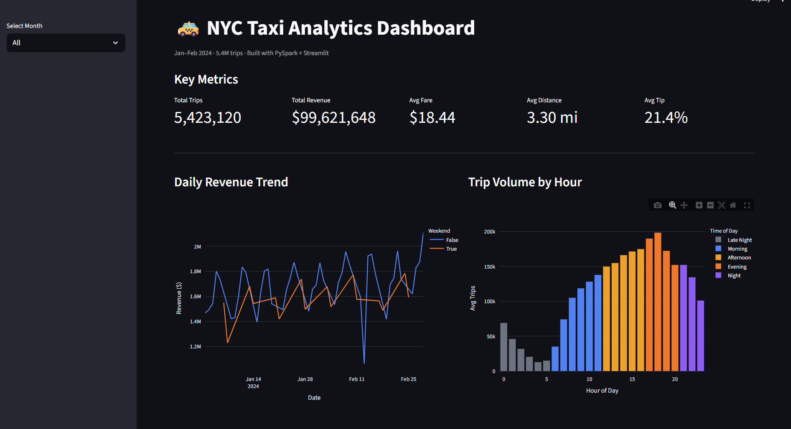
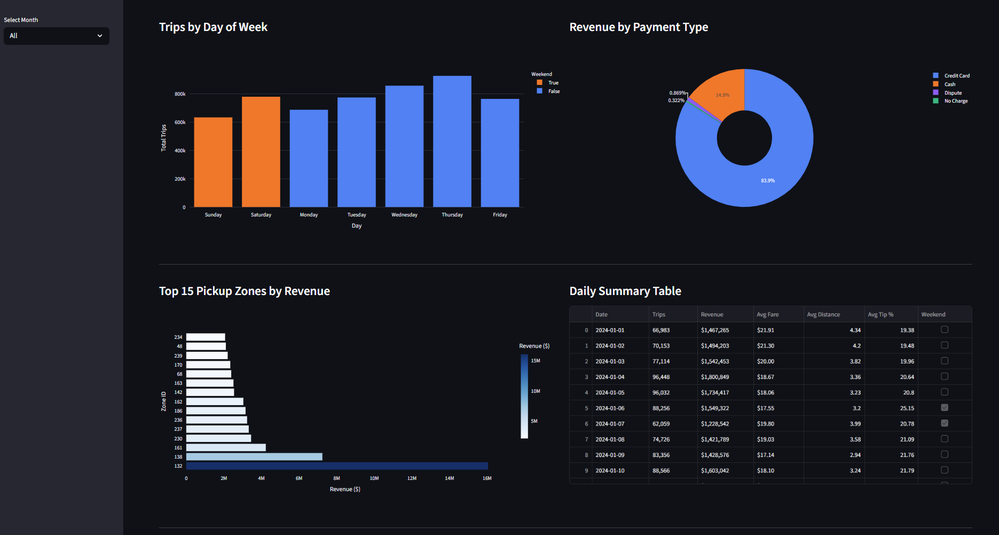

# NYC Taxi Analytics — PySpark Pipeline

End-to-end data engineering pipeline processing 5.4M NYC taxi trips through 
a medallion architecture using PySpark, with a Streamlit analytics dashboard.

## Architecture


All layers run via `spark-submit` inside a Docker Jupyter container.
Each layer is independently rerunnable — reprocessing silver for a date
does not affect other dates or the gold tables.

## Tech Stack

| Layer | Tool |
|---|---|
| Processing | PySpark 3.5 |
| Storage | Parquet (partitioned by month) |
| Infrastructure | Docker |
| Dashboard | Streamlit + Plotly |

## Pipeline

| Layer | Rows | Description |
|---|---|---|
| Bronze | 5,972,131 | Raw data + ingestion metadata, partitioned by month |
| Silver | 5,423,120 | Cleaned, enriched with derived columns (duration, speed, time of day) |
| Gold | 5 tables | Hourly, daily, zone, payment, weekday aggregations |

## Data Quality (Silver Layer)
- Dropped 549,011 rows (9.2%) — nulls, invalid fares, impossible speeds
- Added derived columns: trip duration, speed mph, time of day, tip percentage
- Filtered to valid 2024 timestamps only

## Gold Tables
- `hourly_metrics` — revenue + volume by hour of day
- `daily_metrics` — daily revenue trend, weekday vs weekend
- `zone_metrics` — top pickup zones by revenue
- `payment_metrics` — breakdown by payment type
- `weekday_metrics` — day of week patterns

## Setup

```bash
git clone https://github.com/ayushchandel93/nyc-taxi-spark.git
cd nyc-taxi-spark

# Start Jupyter container
docker compose up -d

# Download NYC TLC data to data/raw/
# https://www.nyc.gov/site/tlc/about/tlc-trip-record-data.page

# Run pipeline
docker compose exec jupyter /usr/local/spark/bin/spark-submit /home/jovyan/src/bronze.py
docker compose exec jupyter /usr/local/spark/bin/spark-submit /home/jovyan/src/silver.py
docker compose exec jupyter /usr/local/spark/bin/spark-submit /home/jovyan/src/gold.py

# Run dashboard
python -m streamlit run dashboard/app.py
```

## Dashboard





- 5 KPI cards — 5.4M trips, $99.6M revenue, $18.44 avg fare, 3.30 mi, 21.4% tip
- Daily revenue trend with weekday vs weekend split
- Trip volume by hour — clear evening peak at 5–8pm
- 83.9% of payments by credit card
- Zone 132 (JFK Airport) dominates revenue across all zones
- Daily summary table with formatted metrics


## Key Findings

- Average NYC taxi trip: 3.30 miles, $18.44 fare, 21.4% tip rate — reflects real NYC traffic at ~11 mph
- 9.2% of raw data removed (549,011 rows) — negative fares, zero distances, corrupt timestamps
- Credit card dominates at 83.9% of all payments — significantly higher tip rates than cash
- Evening hours (5–8pm) show the highest trip volume — 3× more than late night (2–4am)
- Zone 132 (JFK Airport) is the single highest revenue pickup zone by a large margin
- Weekday trips outnumber weekend trips but Saturday shows higher per-trip revenue
